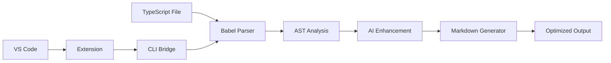

# Contributing to M2JS

🎉 **Thank you for your interest in contributing to M2JS!**

M2JS is an open-source project that transforms TypeScript/JavaScript into LLM-friendly Markdown documentation. We welcome contributions from developers of all experience levels.

## 📋 Table of Contents

1. [Code of Conduct](#code-of-conduct)
2. [Getting Started](#getting-started)
3. [Development Setup](#development-setup)
4. [Contribution Guidelines](#contribution-guidelines)
5. [Project Architecture](#project-architecture)
6. [Development Rules (CLAUDE.md)](#development-rules)
7. [Testing Guidelines](#testing-guidelines)
8. [Pull Request Process](#pull-request-process)
9. [Community](#community)

## Code of Conduct

### Our Pledge
We are committed to making participation in M2JS a harassment-free experience for everyone, regardless of age, body size, disability, ethnicity, gender identity and expression, level of experience, nationality, personal appearance, race, religion, or sexual identity and orientation.

### Our Standards
**Positive behavior includes:**
- Using welcoming and inclusive language
- Being respectful of differing viewpoints and experiences
- Gracefully accepting constructive criticism
- Focusing on what is best for the community
- Showing empathy towards other community members

**Unacceptable behavior includes:**
- Harassment, trolling, or derogatory comments
- Publishing others' private information without permission
- Spamming or excessive self-promotion
- Any conduct that could reasonably be considered inappropriate

## Getting Started

### 🎯 Ways to Contribute

#### 🐛 **Bug Reports**
- Found a bug? [Create an issue](https://github.com/paulohenriquevn/m2js/issues/new?template=bug_report.yml)
- Include steps to reproduce, expected vs actual behavior
- Provide sample TypeScript/JavaScript files if relevant

#### ✨ **Feature Requests**
- Have an idea? [Suggest a feature](https://github.com/paulohenriquevn/m2js/issues/new?template=feature_request.yml)
- Explain the problem it solves and potential use cases
- Consider implementation complexity and breaking changes

#### 📝 **Documentation**
- Improve README, guides, or code comments
- Add examples and tutorials
- Fix typos or unclear explanations

#### 🔧 **Code Contributions**
- Fix bugs or implement new features
- Improve performance or code quality
- Add support for new TypeScript/JavaScript patterns

#### 🧪 **Testing**
- Add test cases for edge cases
- Improve test coverage
- Test with real-world codebases

## Development Setup

### Prerequisites
- **Node.js**: 16.0.0 or higher
- **npm**: 7.0.0 or higher
- **Git**: Latest version
- **VS Code**: Recommended for extension development

### 🚀 Quick Setup

```bash
# 1. Fork and clone the repository
git clone https://github.com/YOUR-USERNAME/m2js.git
cd m2js

# 2. Install dependencies
npm install

# 3. Build the project
npm run build

# 4. Run tests
npm test

# 5. Test CLI locally
npm link
m2js examples/User.ts

# 6. (Optional) VS Code extension development
cd vscode-extension
npm install
npm run compile
# Press F5 to launch Extension Development Host
```

### 🔧 Development Commands

```bash
# Core CLI development
npm run dev          # Watch mode compilation
npm run build        # Production build
npm test             # Run all tests
npm run test:watch   # Watch mode testing
npm run test:coverage # Coverage report
npm run lint         # ESLint check
npm run lint:fix     # Auto-fix linting issues
npm run type-check   # TypeScript validation

# VS Code extension
cd vscode-extension
npm run compile      # Compile extension
npm run watch        # Watch mode compilation
vsce package         # Package extension (.vsix)

# Quality gates
npm run validate     # Full validation pipeline
npm run ci          # CI-like validation
```

### 📁 Project Structure

```
m2js/
├── src/                     # Core CLI source code
│   ├── cli.ts              # CLI interface and commands
│   ├── parser.ts           # TypeScript/JavaScript parsing
│   ├── generator.ts        # Markdown generation
│   ├── types.ts            # Type definitions
│   ├── *-analyzer.ts       # AI enhancement modules
│   └── utils/              # Utility functions
├── tests/                   # Test files
│   ├── fixtures/           # Test input/output files
│   └── *.test.ts          # Unit and integration tests
├── vscode-extension/        # VS Code extension
│   ├── src/               # Extension source code
│   ├── package.json       # Extension manifest
│   └── README.md          # Extension documentation
├── docs/                   # Project documentation
├── examples/               # Example files for testing
├── .github/                # GitHub Actions workflows
└── CLAUDE.md              # Development rules and standards
```

## Contribution Guidelines

### 🎯 CLAUDE.md Compliance

**M2JS follows strict development rules defined in CLAUDE.md. These are MANDATORY:**

#### 1. **KISS (Keep It Simple, Stupid)**
```typescript
// ✅ GOOD: Simple and clear
function parseFile(filePath: string): ParsedFile {
  const content = readFileSync(filePath, 'utf8');
  return babel.parse(content);
}

// ❌ BAD: Over-engineered
class ConfigurableParserFactoryWithPluginSupport {
  // Complex abstraction without immediate value
}
```

#### 2. **FAIL-FAST**
```typescript
// ✅ GOOD: Fail quickly with clear message
function analyzeFile(filePath: string): Analysis {
  if (!existsSync(filePath)) {
    throw new Error(`File not found: ${filePath}`);
  }
  if (!filePath.match(/\.(ts|tsx|js|jsx)$/)) {
    throw new Error(`Unsupported file type: ${filePath}`);
  }
  // Continue processing...
}

// ❌ BAD: Silent failure or unclear errors
function analyzeFile(filePath: string): Analysis | null {
  try {
    // ... processing
    return result;
  } catch {
    return null; // User doesn't know what went wrong
  }
}
```

#### 3. **VERTICAL SLICE**
Every contribution must deliver complete end-to-end value:
- CLI interface changes
- Core logic implementation  
- Test coverage
- Documentation updates

#### 4. **ANTI-MOCK**
Use real integrations in development (mocks only in unit tests):
```typescript
// ✅ GOOD: Real file system operations
const content = readFileSync(filePath, 'utf8');
const ast = babel.parse(content);

// ❌ BAD: Mocking in development
const mockFs = { readFileSync: jest.fn() };
```

### 📏 Code Quality Standards

#### File and Function Limits
- **Files**: Maximum 300 lines
- **Functions**: Maximum 30 lines  
- **Complexity**: Maximum cyclomatic complexity of 15
- **Nesting**: Maximum 4 levels of nesting

#### TypeScript Standards
```typescript
// ✅ REQUIRED: Strict TypeScript
export function parseType(node: t.Node): string {
  if (t.isStringTypeAnnotation(node)) {
    return 'string';
  }
  // Always have complete type coverage
}

// ❌ FORBIDDEN: Any types
function processData(data: any): any {
  // Never use 'any' in production code
}
```

#### Code Style
- **ESLint**: Must pass without warnings
- **Prettier**: Auto-formatting required
- **No console.log**: Remove before committing
- **Descriptive names**: Variables and functions should be self-documenting

### 🧪 Testing Requirements

#### Test Coverage
- **Minimum**: 80% line coverage for core functionality
- **Unit Tests**: All public functions
- **Integration Tests**: End-to-end CLI workflows
- **Edge Cases**: Error conditions and boundary cases

#### Test Structure
```typescript
describe('Parser', () => {
  describe('parseFile', () => {
    it('should extract exported functions', () => {
      // Arrange
      const input = `export function test() {}`;
      
      // Act
      const result = parseFile(input);
      
      // Assert
      expect(result.functions).toHaveLength(1);
      expect(result.functions[0].name).toBe('test');
    });

    it('should throw error for invalid syntax', () => {
      const input = `export function broken( {`;
      
      expect(() => parseFile(input)).toThrow('Parse error');
    });
  });
});
```

## Project Architecture

### 🧩 Core Components

#### 1. **Parser Engine** (`src/parser.ts`)
- Babel AST processing
- Type extraction and resolution
- Export filtering
- JSDoc comment processing

#### 2. **Generator Engine** (`src/generator.ts`)
- Markdown template generation
- Token optimization
- Dependency graph creation
- Output formatting

#### 3. **AI Enhancement Pipeline**
- **Business Context Analyzer**: Domain detection
- **Architecture Analyzer**: Pattern recognition  
- **Semantic Analyzer**: Entity relationships
- **Usage Pattern Analyzer**: Code examples

#### 4. **VS Code Extension**
- **Extension Host**: VS Code integration
- **CLI Bridge**: Communication with M2JS CLI
- **Webview Provider**: Interactive result display
- **Template Wizard**: Guided template creation

### 🔄 Data Flow



## Development Rules

### 🚫 What NOT to Do

1. **Don't over-engineer**: Prefer simple solutions
2. **Don't add dependencies**: Each new dependency must be justified
3. **Don't break existing APIs**: Maintain backward compatibility
4. **Don't ignore tests**: All code changes require tests
5. **Don't use 'any' types**: Maintain strict TypeScript compliance

### ✅ What TO Do

1. **Follow CLAUDE.md rules**: These are non-negotiable
2. **Write self-documenting code**: Clear variable and function names
3. **Test edge cases**: Think about error conditions
4. **Keep functions small**: Single responsibility principle
5. **Document public APIs**: JSDoc for all exported functions

### 🎯 Feature Development Guidelines

#### Planning a New Feature
1. **Create GitHub Issue**: Describe the problem and proposed solution
2. **Design Discussion**: Get community feedback on approach
3. **Break Down Work**: Create specific, testable tasks
4. **Implement Vertical Slice**: End-to-end functionality
5. **Test Thoroughly**: Unit, integration, and manual testing

#### Example: Adding New Language Support
```typescript
// 1. Extend parser to handle new syntax
function parseLanguage(content: string, language: Language): ParsedFile {
  switch (language) {
    case 'typescript':
      return parseTypeScript(content);
    case 'python': // New language
      return parsePython(content);
    default:
      throw new Error(`Unsupported language: ${language}`);
  }
}

// 2. Add corresponding tests
describe('Parser - Python Support', () => {
  it('should parse Python class definitions', () => {
    const input = `class UserService:\n    def create_user(self): pass`;
    const result = parseLanguage(input, 'python');
    expect(result.classes).toHaveLength(1);
  });
});

// 3. Update CLI to support new file extensions
const SUPPORTED_EXTENSIONS = ['.ts', '.tsx', '.js', '.jsx', '.py'];

// 4. Add documentation and examples
```

## Testing Guidelines

### 🧪 Testing Strategy

#### 1. **Unit Tests**
- Test individual functions in isolation
- Mock external dependencies
- Focus on business logic and edge cases

#### 2. **Integration Tests**
- Test CLI commands end-to-end
- Use real file system operations
- Verify actual output quality

#### 3. **VS Code Extension Tests**
- Test command registration and execution
- Verify webview functionality
- Test CLI integration

### 📊 Test Categories

```typescript
// Unit Test Example
describe('Business Context Analyzer', () => {
  it('should detect e-commerce domain', () => {
    const code = `
      export class OrderService {
        processPayment(order: Order): Promise<PaymentResult> {}
      }
    `;
    const context = analyzeBusinessContext(parseCode(code));
    expect(context.domain).toBe('ecommerce');
    expect(context.confidence).toBeGreaterThan(80);
  });
});

// Integration Test Example  
describe('CLI Integration', () => {
  it('should generate documentation for real TypeScript file', async () => {
    const result = await execCLI(['examples/User.ts']);
    expect(result.exitCode).toBe(0);
    expect(result.stdout).toContain('# 📝 User.ts');
    expect(result.stdout).toContain('## 🔧 Functions');
  });
});
```

### 🎯 Coverage Goals

| Component | Coverage Target | Priority |
|-----------|----------------|----------|
| Parser Engine | 95% | Critical |
| Generator Engine | 90% | High |
| AI Analyzers | 85% | High |
| CLI Interface | 80% | Medium |
| VS Code Extension | 75% | Medium |

## Pull Request Process

### 📝 Before Submitting

1. **✅ Code Quality Checklist**
   - [ ] Follows CLAUDE.md rules
   - [ ] Passes all tests (`npm test`)
   - [ ] Passes linting (`npm run lint`)
   - [ ] Passes type checking (`npm run type-check`)
   - [ ] Builds successfully (`npm run build`)

2. **✅ Documentation Checklist**
   - [ ] Updated README if needed
   - [ ] Added/updated JSDoc comments
   - [ ] Created/updated tests
   - [ ] Updated CHANGELOG.md

3. **✅ Testing Checklist**
   - [ ] Added unit tests for new functionality
   - [ ] Added integration tests if applicable
   - [ ] Tested manually with real files
   - [ ] Verified VS Code extension works (if applicable)

### 📋 PR Template

When creating a pull request, use our template:

```markdown
## 📋 Description
Brief description of changes and motivation

## 🎯 Type of Change
- [ ] 🐛 Bug fix (non-breaking change that fixes an issue)
- [ ] ✨ New feature (non-breaking change that adds functionality)
- [ ] 💥 Breaking change (fix or feature that would cause existing functionality to change)
- [ ] 📚 Documentation update
- [ ] 🔧 Maintenance (dependency updates, build improvements, etc.)

## 🧪 Testing
- [ ] Unit tests added/updated
- [ ] Integration tests added/updated
- [ ] Manual testing completed
- [ ] VS Code extension testing completed (if applicable)

## 📋 CLAUDE.md Compliance
- [ ] ✅ KISS: Solution is as simple as possible
- [ ] ✅ FAIL-FAST: Errors fail quickly with clear messages
- [ ] ✅ VERTICAL SLICE: Delivers complete end-to-end value
- [ ] ✅ ANTI-MOCK: Uses real integrations (except unit tests)
- [ ] ✅ File size limits: All files < 300 lines
- [ ] ✅ Function size limits: All functions < 30 lines
- [ ] ✅ No TypeScript 'any' types used
- [ ] ✅ No console.log statements in production code
```

### 🔄 Review Process

1. **Automated Checks**: GitHub Actions will run all tests and quality checks
2. **Code Review**: At least one maintainer will review your code
3. **Discussion**: Address any feedback or questions
4. **Approval**: Once approved, maintainers will merge the PR

### ⏰ Response Times

- **Initial Response**: Within 48 hours
- **Review Completion**: Within 1 week for most PRs
- **Complex Features**: May take longer, but we'll keep you updated

## Community

### 💬 Communication Channels

- **GitHub Issues**: Bug reports and feature requests
- **GitHub Discussions**: General questions and community chat
- **Pull Requests**: Code contributions and reviews

### 🎯 Community Guidelines

#### Be Respectful
- Assume positive intent in all interactions
- Provide constructive feedback
- Help newcomers learn and contribute

#### Be Helpful
- Answer questions when you can
- Share your experience and learnings
- Contribute to documentation and examples

#### Be Patient
- Reviews take time to do properly
- Complex features require careful consideration
- Everyone is learning and improving

### 🏆 Recognition

We appreciate all contributions! Contributors will be:
- Listed in our contributors section
- Mentioned in release notes for significant contributions
- Invited to be maintainers for sustained contributions

### 🎉 Getting Help

**Stuck or have questions?**
- Check existing [GitHub Issues](https://github.com/paulohenriquevn/m2js/issues)
- Start a [GitHub Discussion](https://github.com/paulohenriquevn/m2js/discussions)
- Review our [Architecture Documentation](docs/ARCHITECTURE.md)
- Read the [CLAUDE.md](CLAUDE.md) development rules

**First-time contributor?**
Look for issues labeled `good first issue` or `help wanted` to get started!

---

## 🚀 Ready to Contribute?

1. **Fork the repository**
2. **Create a feature branch**: `git checkout -b feature/amazing-feature`
3. **Make your changes**: Follow the guidelines above
4. **Test thoroughly**: `npm run validate`
5. **Commit your changes**: `git commit -m 'feat: add amazing feature'`
6. **Push to your fork**: `git push origin feature/amazing-feature`
7. **Create a Pull Request**: Use our template

**Thank you for contributing to M2JS!** 🙏

Together, we're making AI coding assistance better for developers worldwide. Your contributions help create a tool that saves time, reduces cognitive load, and enables better collaboration between humans and AI.

---

*This contributing guide follows our [Code of Conduct](CODE_OF_CONDUCT.md). By participating, you agree to uphold these standards.*