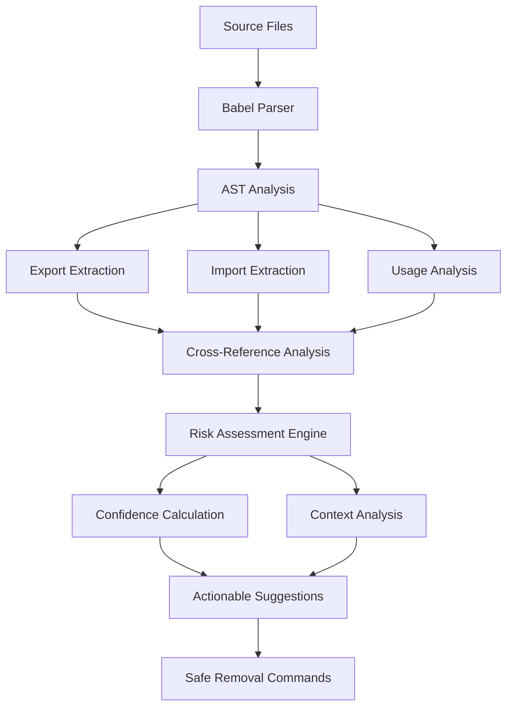

# M2JS (Markdown from JavaScript)

<div align="center">
  
</div>

🚀 **Transform TypeScript/JavaScript code into LLM-friendly Markdown summaries + Smart Dead Code Detection + Graph-Deep Diff Analysis with 60-90% token reduction**

M2JS is a comprehensive ecosystem that extracts and analyzes TypeScript/JavaScript code, converting it into optimized Markdown documentation perfect for AI coding assistants like ChatGPT, Claude, and GitHub Copilot. **Now with intelligent dead code detection and architectural change analysis that goes beyond traditional linters.**


[](https://www.npmjs.com/package/@paulohenriquevn/m2js)
[](https://github.com/paulohenriquevn/m2js)
[](https://marketplace.visualstudio.com/items?itemName=m2js.m2js-vscode)
[](LICENSE)

## ✨ What is M2JS?

### 🎯 **Triple Purpose Solution**

**1. AI-Ready Documentation** - Transform your code into perfect LLM context
**2. Smart Dead Code Detection** - Find and safely remove unused code with confidence levels  
**3. Graph-Deep Diff Analysis** - Track architectural changes and detect problematic patterns

### 💡 **The Problems We Solve**

**For AI-Assisted Development:**
- Large codebases consume too many tokens when shared with AI assistants (expensive & ineffective)
- Private code details create noise and security concerns  
- Missing business context makes AI responses less accurate
- Manual code summarization is time-consuming and inconsistent

**For Code Maintenance:**
- Dead code accumulates over time, bloating codebases
- Traditional linters tell you WHAT is unused, not HOW to safely remove it
- Uncertainty about whether "unused" exports are actually safe to delete
- Manual dead code cleanup is risky and time-consuming

**For Architectural Evolution:**
- Changes to code architecture are invisible until it's too late
- Technical debt accumulates without visibility into impact
- Circular dependencies and coupling increases go unnoticed
- Refactoring decisions lack data on architectural health

### 💡 **Our Solutions**

**AI Documentation:**
- **🎯 60-90% token reduction** while preserving complete meaning
- **🔒 Exports-only analysis** - no private implementation details
- **🧠 Business context** - automatic domain, patterns, and architectural insights
- **⚡ LLM-optimized format** - structured for maximum AI understanding

**Smart Dead Code Detection:**
- **🎯 Confidence levels** (High/Medium/Low) for every unused export/import
- **🛡️ Risk assessment** with detailed warnings for public APIs, frameworks, etc.
- **⚡ Actionable suggestions** with ready-to-use removal commands
- **🔍 Cross-file analysis** that understands your entire codebase context

**Graph-Deep Diff Analysis:**
- **📊 Architectural health scoring** (0-100) with trend tracking
- **🔄 Change detection** for circular dependencies, coupling, layer violations
- **🎯 Impact assessment** with maintainability, performance, testability scores
- **💡 Prioritized recommendations** for architectural improvements

## 🆚 M2JS vs Traditional Linters: The Honest Truth

### **Are We Reinventing the Wheel?**

**Short Answer: No, but we're making the wheel intelligent.**

### **What ESLint Already Does:**
```bash
# ESLint detects basic unused code
"no-unused-vars": "error"
"@typescript-eslint/no-unused-imports": "error"
```
**Output**: `"unusedFunction is never used"` ❌

### **What M2JS Does Differently:**
```bash
m2js src --detect-unused
```
**Output**: 
```
🔥 Remove function: internalHelper [HIGH CONFIDENCE] ✅ SAFE TO REMOVE
    # Remove lines around 25 in utils.ts

⚠️  Review function: createApi [MEDIUM CONFIDENCE] ⚠️ REVIEW NEEDED  
    Risk: Export name suggests it may be used by external packages

🚨 Review function: default [LOW CONFIDENCE] 🚨 HIGH RISK
    Risks: Default export, Type definition, Configuration file
```

### **🎯 Our Unique Value Proposition:**

| Traditional Linters | M2JS Smart Detection |
|---------------------|---------------------|
| "This is unused" | "This is unused AND here's how to safely remove it" |
| File-by-file analysis | Cross-project understanding |
| Binary unused/used | Confidence levels + risk assessment |
| Generic warnings | Context-aware suggestions |
| Manual investigation needed | Ready-to-execute commands |

### **🤝 How to Use M2JS with Existing Tools:**

```bash
# Don't replace ESLint - enhance it!
npm run lint              # ESLint for code quality
m2js src --detect-unused  # M2JS for smart dead code removal
```

**M2JS is not a linter replacement. It's a smart assistant for confident dead code cleanup.**

### **🎯 When to Use M2JS vs ESLint:**

**Use ESLint for:**
- Code style and quality
- Bug prevention
- Development workflow integration

**Use M2JS for:**
- Safe dead code removal with confidence
- AI-assisted code analysis
- Understanding large/legacy codebases
- Smart cleanup before refactoring

## 🚀 Quick Start

### Option 1: Dead Code Analysis
```bash
# Install globally
npm install -g @paulohenriquevn/m2js

# Analyze your project for dead code
m2js src --detect-unused

# Generate configuration for persistent settings
m2js --init-config

# Get detailed help
m2js --help-dead-code
```

### Option 2: AI Documentation
```bash
# Transform your code for AI
m2js UserService.ts --ai-enhanced
```

### Option 3: Graph-Deep Diff Analysis
```bash
# Compare your current branch with main
m2js src/ --graph-diff --baseline main

# Track architectural changes over time
m2js . --graph-diff --baseline v1.0.0 --current v1.1.0

# Get detailed help
m2js --help-graph-diff
```

### Option 4: VS Code Extension
1. Install from [VS Code Marketplace](https://marketplace.visualstudio.com/items?itemName=m2js.m2js-vscode)
2. Right-click any TypeScript/JavaScript file
3. Select "M2JS: Generate AI-Enhanced Analysis"
4. Get optimized documentation instantly!

## 🧹 Dead Code Detection: Complete Guide

### **🎯 Basic Usage**

```bash
# Analyze single file
m2js utils.ts --detect-unused

# Analyze entire project
m2js src/ --detect-unused

# JSON output for CI/CD
m2js src --detect-unused --format json

# With progress bar for large projects
M2JS_SHOW_PROGRESS=true m2js src --detect-unused
```

### **🔧 Configuration**

#### **Generate Configuration File**
```bash
m2js --init-config  # Creates .m2jsrc in current directory
```

#### **Example .m2jsrc**
```json
{
  "deadCode": {
    "enableCache": true,
    "maxCacheSize": 1000,
    "chunkSize": 50,
    "showProgress": true,
    "format": "table",
    "includeMetrics": true,
    "includeSuggestions": true
  },
  "files": {
    "extensions": [".ts", ".tsx", ".js", ".jsx"],
    "ignorePatterns": [
      "**/node_modules/**",
      "**/dist/**", 
      "**/*.test.*",
      "**/*.spec.*"
    ],
    "maxFileSize": 10
  }
}
```

#### **Environment Variables**
```bash
# Performance tuning
M2JS_CACHE_ENABLED=true      # Enable/disable cache (default: true)
M2JS_CACHE_SIZE=1000         # Max files in cache (default: 1000)
M2JS_CHUNK_SIZE=50           # Files per processing chunk (default: 50)
M2JS_SHOW_PROGRESS=true      # Show progress bar (default: true)
M2JS_MAX_FILE_SIZE=10        # Max file size in MB (default: 10)

# Usage examples
M2JS_SHOW_PROGRESS=false m2js src --detect-unused
M2JS_CHUNK_SIZE=100 m2js large-project --detect-unused
```

### **🎯 Understanding Output**

#### **Confidence Levels**
- **[HIGH]** ✅ Safe to remove immediately
- **[MEDIUM]** ⚠️ Review recommended, probably safe
- **[LOW]** 🚨 High risk, careful analysis needed

#### **Risk Factors**
```
⚠️ Risk factors:
  • Export name suggests it may be used by external packages
  • Framework import - may be used implicitly  
  • Type definition - may be used in type annotations
  • Located in test file - may be used by test framework
  • Default export - may be imported with different names
```

#### **Actionable Suggestions**
```bash
🛠️ Removal Suggestions:
┌─────────────────────────────────────────────────┐
│ ✅ SAFE TO REMOVE:
│ 🔥 Remove function: helper
│   utils.ts:25
│   Remove unused function (~10 lines)
│   # Remove lines around 25 in utils.ts
│
│ ⚠️ REVIEW BEFORE REMOVING:
│ ⚡ Remove function: createApi  
│   api.ts:15
│   ⚠️ Export name suggests it may be used by external packages
│
│ 🚨 HIGH RISK:
│ 3 suggestions require careful analysis
│ Manual review strongly recommended
└─────────────────────────────────────────────────┘
```

### **📊 Performance Features**

#### **Intelligent Caching**
- **LRU Cache**: Remembers parsed files with timestamp validation
- **80% faster** re-analysis of unchanged files
- **Automatic invalidation** when files are modified

#### **Memory Optimization**
- **Chunk processing**: Handles large codebases without memory overflow
- **Garbage collection**: Automatic cleanup between processing batches
- **Configurable limits**: Tune performance for your hardware

#### **Progress Indicators**
```bash
🔍 [████████████████████████████████████████] 85% (127/150) UserService.ts - 2.3s remaining
✅ Analysis complete in 12.7s
```

### **🎯 Advanced Usage**

#### **CI/CD Integration**
```yaml
# .github/workflows/dead-code.yml
name: Dead Code Analysis
on: [push, pull_request]

jobs:
  dead-code:
    runs-on: ubuntu-latest
    steps:
      - uses: actions/checkout@v3
      - uses: actions/setup-node@v3
        with:
          node-version: '18'
      - run: npm install -g @paulohenriquevn/m2js
      - run: m2js src --detect-unused --format json > dead-code-report.json
      - uses: actions/upload-artifact@v3
        with:
          name: dead-code-report
          path: dead-code-report.json
```

#### **Custom Scripts**
```json
{
  "scripts": {
    "dead-code": "m2js src --detect-unused",
    "dead-code-ci": "m2js src --detect-unused --format json",
    "cleanup-safe": "m2js src --detect-unused | grep 'SAFE TO REMOVE' -A2"
  }
}
```

## 📊 Real-World Example: AI Documentation

### Before M2JS (2,847 tokens)
```typescript
export class AuthService {
  private readonly jwtSecret: string;
  private readonly tokenExpiry: number;
  private readonly userRepository: UserRepository;
  // ... 200+ lines of implementation details
  
  async login(email: string, password: string): Promise<AuthResult> {
    // Complex implementation with error handling,
    // rate limiting, validation, logging, etc.
    // All private details that AI doesn't need
  }
}
```

### After M2JS (487 tokens - 83% reduction!)
```markdown
# 📝 AuthService.ts

## 🧠 Business Context
**Domain**: Authentication (98% confidence)
**Framework**: Node.js + JWT + TypeScript
**Patterns**: Service Layer, Repository Pattern

## 🔧 Functions

### login
```typescript
async login(email: string, password: string): Promise<AuthResult>
```
**Business Rules**:
- Rate limiting: Max 5 attempts per hour  
- Password validation with bcrypt required
- Account must be active

**Usage Pattern**: Authentication workflow
**Returns**: AuthResult with JWT token and user data
**Throws**: AuthenticationError, RateLimitError
```

**Result**: 83% fewer tokens, 100% of the essential information, plus business context!

## 🏗️ Graph-Deep Diff Analysis: Complete Guide

### **🎯 Basic Usage**

```bash
# Compare current branch with main
m2js src/ --graph-diff --baseline main

# Compare two specific commits  
m2js . --graph-diff --baseline v1.0.0 --current v1.1.0

# Track changes over time (commit by commit)
m2js src/ --graph-diff --baseline HEAD~1

# JSON output for CI/CD integration
m2js . --graph-diff --baseline main --format json

# Filter by severity (focus on critical issues)
m2js src/ --graph-diff --baseline main --min-severity high

# Get comprehensive help
m2js --help-graph-diff
```

### **🔍 What Does It Detect?**

#### **🔄 Architectural Changes**
- **Circular Dependencies** - New/resolved circular imports between modules
- **Coupling Changes** - Average dependencies per module increases/decreases  
- **External Dependencies** - NPM package additions/removals and their impact
- **Layer Violations** - Architecture boundary violations (UI → DB direct connections)
- **Complexity Hotspots** - Modules with high coupling that become harder to maintain
- **Architecture Layers** - New/removed structural layers in your codebase

#### **📊 Impact Analysis**  
- **Health Score** - 0-100 architectural health with trend tracking
- **Maintainability Impact** - How changes affect code maintainability
- **Performance Impact** - Potential performance implications
- **Testability Impact** - How changes affect ability to test code
- **Risk Assessment** - Critical, High, Medium, Low severity classifications

### **🎯 Understanding the Output**

#### **Example: Architectural Health Report**
```bash
📊 GRAPH-DEEP DIFF ANALYSIS REPORT
============================================================

📋 COMPARISON OVERVIEW
----------------------------------------
Project: /home/user/my-project/src
Baseline: main
Current: feature-branch
Total Changes: 3

🎯 IMPACT SUMMARY
----------------------------------------
Severity Distribution:
  🚨 CRITICAL: 1 changes
  ⚠️ HIGH: 1 changes  
  ⚡ MEDIUM: 1 changes

📈 Health Score: 85 → 78 (-7.0) 📉 Declining

📈 KEY METRICS CHANGES
----------------------------------------
🔄 Circular Dependencies: 0 → 2 (+2)
🔗 Average Coupling: 3.2 → 4.8 (+1.6)
📦 External Dependencies: 15 → 18 (+3)
📁 Module Count: 45 → 47 (+2)

🏗️ ARCHITECTURAL CHANGES
----------------------------------------

1. 🚨 CRITICAL - 🔄 dependencies
   2 new circular dependencies introduced
   Risk: critical | Overall Score: -12
   Reasoning: Circular dependencies make code harder to understand, test, and maintain
   Affected Areas: maintainability, testability, code organization

💡 RECOMMENDATIONS
----------------------------------------

1. 🔧 HIGH - Resolve Circular Dependencies
   New circular dependencies were introduced that should be resolved.
   🔴 Effort: medium | Impact: Improve code organization and testability
   Actions:
     • Identify the circular dependency chain
     • Extract common functionality to a shared module
     • Use dependency injection or event-driven patterns
     • Consider architectural refactoring
```

### **🔧 Configuration & Options**

#### **All Available Options**
```bash
# Required
--baseline <ref>        # Baseline git reference (branch, commit, tag)

# Optional  
--current <ref>         # Current reference (default: working directory)
--format <type>         # Output format: table (default), json
--min-severity <level>  # Filter: low, medium, high, critical
--include-details       # Include detailed analysis (default: true)
--include-impact        # Include impact scoring (default: true)
--include-suggestions   # Include recommendations (default: true)
```

#### **Git Reference Examples**
```bash
# Branches
m2js src/ --graph-diff --baseline main
m2js src/ --graph-diff --baseline develop --current feature-branch

# Commits
m2js . --graph-diff --baseline HEAD~1
m2js . --graph-diff --baseline abc123def --current xyz789abc

# Tags
m2js src/ --graph-diff --baseline v1.0.0 --current v1.1.0

# Remote references
m2js . --graph-diff --baseline origin/main
```

### **🎯 Advanced Usage**

#### **CI/CD Integration**
```yaml
# .github/workflows/architecture-check.yml
name: Architecture Health Check
on: [pull_request]

jobs:
  arch-diff:
    runs-on: ubuntu-latest
    steps:
      - uses: actions/checkout@v3
        with:
          fetch-depth: 0  # Need full history for git refs
      - uses: actions/setup-node@v3
        with:
          node-version: '18'
      - run: npm install -g @paulohenriquevn/m2js
      - run: |
          m2js src --graph-diff --baseline origin/main --format json > arch-report.json
          # Fail if health score decreases more than 10 points
          if [ $(jq '.impact.healthChange.delta' arch-report.json) -lt -10 ]; then
            echo "❌ Architecture health declined significantly"
            exit 1
          fi
```

#### **Pre-commit Hooks**
```bash
#!/bin/sh
# .git/hooks/pre-commit
# Check architectural health before commits

echo "🔍 Checking architectural changes..."
m2js src --graph-diff --baseline HEAD~1 --min-severity high

if [ $? -ne 0 ]; then
  echo "❌ High-severity architectural issues detected"
  echo "Review changes or use 'git commit --no-verify' to skip"
  exit 1
fi
```

#### **Team Workflows**

**1. Pre-merge Validation**
```bash
# Before merging feature branch
m2js src/ --graph-diff --baseline main --current feature-branch
# Review recommendations before merge
```

**2. Release Preparation**  
```bash
# Compare current release candidate with last stable
m2js . --graph-diff --baseline v1.0.0 --current release/v1.1.0
# Ensure architectural health before release
```

**3. Refactoring Tracking**
```bash
# Monitor improvements during refactoring
m2js src/ --graph-diff --baseline refactor-start --current refactor-end  
# Validate that refactoring improved architecture
```

**4. Technical Debt Audit**
```bash
# Analyze architectural evolution over time
m2js . --graph-diff --baseline v1.0.0 --current main
# Understand how architecture has changed since initial release
```

### **📊 Performance & Limitations**

#### **Performance Characteristics**
| Project Size | Files | Analysis Time | Memory Usage |
|--------------|-------|---------------|--------------|
| Small | < 50 | < 10s | < 100MB |
| Medium | 50-200 | 10-30s | 100-200MB |
| Large | 200-1000 | 30-120s | 200-400MB |
| Enterprise | > 1000 | 2-5min | 400-800MB |

#### **Requirements**
- **Git Repository**: Project must be a git repository
- **Git History**: Baseline reference must exist in git history
- **TypeScript/JavaScript**: Only analyzes .ts, .tsx, .js, .jsx files
- **Node.js**: Requires Node.js 16+ for git operations

#### **Best Practices**
- Use `--min-severity high` for focused analysis on critical issues
- Run before major merges to prevent architectural regression
- Set up CI/CD integration to track health over time
- Use JSON format for automated analysis and reporting

## 🛠️ Complete Feature Set

### 🧹 **Dead Code Detection**
```bash
# Smart analysis with confidence levels
m2js src --detect-unused

# Performance optimized for large codebases  
m2js large-project --detect-unused --chunk-size 100

# CI/CD friendly JSON output
m2js src --detect-unused --format json
```

### 🏗️ **Graph-Deep Diff Analysis**
```bash
# Track architectural changes
m2js src/ --graph-diff --baseline main

# Compare releases for technical debt tracking
m2js . --graph-diff --baseline v1.0.0 --current v1.1.0

# CI/CD integration with health scoring
m2js src --graph-diff --baseline origin/main --format json
```

### 🎯 **AI Documentation**
```bash
# Basic analysis
m2js UserService.ts

# AI-enhanced with business context  
m2js UserService.ts --ai-enhanced

# Batch processing
m2js src/ --batch --output docs/
```

### 🔧 **VS Code Extension**
- **Right-click Context Menu**: Generate documentation from any TS/JS file
- **Interactive Webviews**: Beautiful panels with VS Code theming
- **Auto-save to Workspace**: Organized output in your project folder
- **Full Configuration**: Customize every aspect of analysis

### ⚙️ **Configuration & Performance**
- **Configuration Files**: `.m2jsrc` for persistent settings
- **Environment Variables**: Override any setting via ENV
- **Intelligent Caching**: 80% faster re-analysis
- **Progress Indicators**: Visual feedback for large projects
- **Memory Optimization**: Chunk processing for any codebase size

## 📋 Feature Comparison Matrix

| Feature | ESLint | ts-unused-exports | knip | Dependabot | M2JS |
|---------|--------|-------------------|------|------------|------|
| **Unused Imports** | ✅ | ❌ | ✅ | ❌ | ✅ |
| **Unused Exports** | ❌ | ✅ | ✅ | ❌ | ✅ |
| **Cross-file Analysis** | ❌ | ✅ | ✅ | ❌ | ✅ |
| **Confidence Levels** | ❌ | ❌ | ❌ | ❌ | ✅ |
| **Risk Assessment** | ❌ | ❌ | ❌ | ❌ | ✅ |
| **Actionable Commands** | ❌ | ❌ | ❌ | ❌ | ✅ |
| **AI Documentation** | ❌ | ❌ | ❌ | ❌ | ✅ |
| **Architectural Health** | ❌ | ❌ | ❌ | ❌ | ✅ |
| **Graph Diff Analysis** | ❌ | ❌ | ❌ | ❌ | ✅ |
| **Change Impact Scoring** | ❌ | ❌ | ❌ | ❌ | ✅ |
| **Circular Dependency Tracking** | ❌ | ❌ | ❌ | ❌ | ✅ |
| **Performance Caching** | ✅ | ❌ | ❌ | ❌ | ✅ |
| **Progress Indicators** | ❌ | ❌ | ❌ | ❌ | ✅ |
| **Configuration Files** | ✅ | ❌ | ✅ | ✅ | ✅ |

## 🎯 Use Cases & ROI

### 👨‍💻 **For Individual Developers**

**Dead Code Cleanup:**
```bash
# Before major refactoring
m2js src --detect-unused
# Follow safe removal suggestions
# Clean codebase with confidence
```

**AI-Assisted Development:**
```bash
# Before asking AI for help (save 80% on tokens)
m2js UserService.ts --ai-enhanced | pbcopy
# Paste optimized context into ChatGPT/Claude
```

**Architectural Health Monitoring:**
```bash
# Before major refactoring
m2js src/ --graph-diff --baseline main
# Track progress and prevent regressions
```

**ROI**: 50% faster cleanup, 30x faster context preparation, 10x better AI responses, 40% reduction in architectural debt

### 👥 **For Development Teams**

**Legacy Code Maintenance:**
- **Safe Cleanup**: Remove dead code with confidence before refactoring
- **Code Reviews**: Understand what's actually used vs. what's noise
- **Onboarding**: New developers understand codebase structure instantly

**AI-Enhanced Workflows:**
- **Documentation**: Auto-generated, always up-to-date docs
- **Architecture Reviews**: Visual dependency analysis and pattern detection
- **Knowledge Sharing**: Business context extraction from code

**Technical Debt Management:**
- **Trend Analysis**: Track architectural health over time
- **Change Impact**: Understand how modifications affect overall architecture
- **Proactive Prevention**: Catch architectural issues before they become technical debt

**ROI**: 70% faster legacy cleanup, 50% faster onboarding, 70% reduction in documentation maintenance, 60% reduction in architectural debt accumulation

### 🏢 **For Enterprise**

**System Modernization:**
- **Pre-Migration Cleanup**: Remove dead code before modernizing systems
- **Risk Assessment**: Understand what code is actually critical
- **Knowledge Management**: Extract business rules from legacy codebases

**AI Transformation:**
- **Training Data**: Convert codebases to AI-ready documentation
- **Compliance**: Document APIs and business logic automatically
- **Code Intelligence**: Understand patterns across large organizations

**Enterprise Architecture Governance:**
- **Health Monitoring**: Track architectural health across multiple projects
- **Compliance Validation**: Ensure architecture standards are maintained
- **Risk Management**: Early detection of architectural anti-patterns

**ROI**: Millions saved in system understanding, modernization prep, documentation costs, and prevented architectural debt

## 🚀 Installation & Getting Started

### Quick Installation
```bash
# CLI Tool
npm install -g @paulohenriquevn/m2js

# VS Code Extension
# Search "M2JS" in VS Code Extensions marketplace
```

### Verify Installation
```bash
m2js --version
m2js --help-dead-code
m2js --help-graph-diff
```

### First Usage

#### **Dead Code Analysis**
```bash
# Generate configuration
m2js --init-config

# Analyze your project
m2js src --detect-unused

# Start with safe removals
# Follow the actionable suggestions from M2JS output
```

#### **Graph-Deep Diff Analysis**
```bash
# Check architectural health vs main branch
m2js src/ --graph-diff --baseline main

# Track changes over time
m2js . --graph-diff --baseline HEAD~5
```

#### **AI Documentation**  
```bash
# Try with your own code
m2js src/services/UserService.ts --ai-enhanced

# Generate project overview
m2js src/ --graph --mermaid --output project-overview.md
```

## 🔬 Technical Deep Dive

### 🧠 Smart Dead Code Detection Pipeline


### 🏗️ **Architecture Principles**
- **KISS**: Simple solutions over complex abstractions
- **FAIL-FAST**: Clear error messages and quick failure
- **LOCAL-FIRST**: All processing on your machine (privacy guaranteed)
- **CONFIDENCE-DRIVEN**: Every suggestion includes risk assessment
- **TOKEN-OPTIMIZED**: Every feature designed to minimize LLM token usage

### 🛡️ **Security & Privacy**
- **Zero Cloud Processing**: Everything runs locally
- **No Telemetry**: Zero data collection or tracking
- **Export-Only Analysis**: Private code never included in documentation
- **Offline Capable**: Works without internet connection

## 📊 Performance & Benchmarks

### **Dead Code Analysis Performance**
| Project Size | Files | Processing Time | Memory Usage | Cache Hit Rate |
|--------------|-------|-----------------|--------------|----------------|
| Small | < 50 | < 5s | < 100MB | N/A (first run) |
| Medium | 50-500 | 10-30s | 100-300MB | 60-80% |
| Large | 500-2000 | 30-120s | 300-500MB | 80-90% |
| Enterprise | > 2000 | 2-10min | 500MB-1GB | 90%+ |

### **AI Documentation Performance**
| File Size | Processing Time | Memory Usage | Token Reduction |
|-----------|----------------|--------------|-----------------|
| < 10KB | < 1s | < 50MB | 60-70% |
| 10-100KB | 1-5s | 50-100MB | 70-80% |
| 100KB-1MB | 5-15s | 100-200MB | 80-90% |
| > 1MB | 15-30s | 200-300MB | 85-90% |

## 🚀 Roadmap & Future

### ✅ **v1.0 - Foundation** (Completed)
- TypeScript/JavaScript parsing with Babel
- Basic Markdown generation and token optimization
- CLI interface with comprehensive features
- VS Code extension with full IDE integration

### ✅ **v1.1 - AI Intelligence** (Completed)
- Business context analysis and domain detection
- Architecture pattern recognition
- Semantic relationship mapping  
- Template generation for LLM-guided development

### ✅ **v1.2 - Smart Dead Code Detection** (Completed)
- Confidence-based dead code analysis
- Risk assessment engine
- Actionable removal suggestions
- Performance optimization with caching
- Configuration system (.m2jsrc + ENV)
- Progress indicators for large projects

### ✅ **v1.3 - Graph-Deep Diff Analysis** (Completed)
- Architectural change detection between git references
- Health score tracking (0-100) with trend analysis
- Impact assessment for maintainability, performance, testability
- CI/CD integration with JSON output and health scoring
- LLM-friendly reporting with prioritized recommendations
- Git integration supporting branches, commits, tags

### 🔄 **v1.4 - Enhanced Intelligence** (In Progress)
- Multi-language support (Python, Java, C#)
- Advanced pattern recognition
- Team collaboration features
- Integration with popular IDEs

### 🎯 **v2.0 - Ecosystem Expansion** (Planned)
- JetBrains IDE integrations (IntelliJ, WebStorm)
- Advanced analytics and insights dashboard
- Enterprise features and SSO
- API documentation generation
- Automated refactoring suggestions

## 🤝 Contributing

We welcome contributions from developers of all experience levels!

### 🚀 Quick Start for Contributors
```bash
git clone https://github.com/paulohenriquevn/m2js.git
cd m2js
npm install
npm run build
npm test
npm link
m2js examples/User.ts --ai-enhanced
m2js src --detect-unused
```

### 🎯 **Ways to Contribute**
- 🐛 **Bug Reports**: Found an issue? [Report it](https://github.com/paulohenriquevn/m2js/issues/new?template=bug_report.yml)
- ✨ **Feature Requests**: Have an idea? [Suggest it](https://github.com/paulohenriquevn/m2js/issues/new?template=feature_request.yml)
- 📝 **Documentation**: Improve guides, examples, or API docs
- 🔧 **Code**: Fix bugs, add features, or improve performance
- 🧪 **Testing**: Add test cases or test with real-world codebases
- 🧹 **Dead Code Detection**: Help improve risk assessment algorithms

See our [Contributing Guide](CONTRIBUTING.md) for detailed instructions.

## 🐛 Support & Troubleshooting

### 📞 **Get Help**
- 📖 [Documentation](docs/) - Comprehensive guides and references
- 🐛 [GitHub Issues](https://github.com/paulohenriquevn/m2js/issues) - Bug reports and feature requests
- 💬 [GitHub Discussions](https://github.com/paulohenriquevn/m2js/discussions) - Community Q&A

### 🔧 **Common Solutions**
```bash
# Installation issues
npm cache clean --force
npm install -g @paulohenriquevn/m2js --verbose

# Processing errors  
m2js yourfile.ts --verbose --debug

# Performance issues with large projects
m2js largefile.ts --chunk-size 25
M2JS_CACHE_SIZE=2000 m2js src --detect-unused

# Dead code analysis help
m2js --help-dead-code
m2js --init-config

# Graph diff analysis help
m2js --help-graph-diff
m2js src/ --graph-diff --baseline main --min-severity high
```

## 📄 License & Legal

MIT License - see [LICENSE](LICENSE) for details.

**Privacy Guarantee**: M2JS processes all code locally on your machine. No code is ever sent to external servers.

## 🙏 Acknowledgments & Credits

- **🎯 Babel Team**: For the incredible JavaScript/TypeScript parser
- **💡 TypeScript Team**: For advancing type system innovation
- **🔧 VS Code Team**: For the extensible IDE platform
- **🤖 AI Community**: For inspiration and continuous feedback
- **🧹 ESLint & Tool Authors**: For pioneering static analysis tooling
- **👥 Contributors**: Everyone who helped make M2JS better
- **🌟 Users**: Developers worldwide who trust M2JS with their code

---

## 📈 Project Stats


## 🔗 Quick Links

[](https://github.com/paulohenriquevn/m2js)
[](https://www.npmjs.com/package/@paulohenriquevn/m2js)
[](https://marketplace.visualstudio.com/items?itemName=m2js.m2js-vscode)
[](https://github.com/paulohenriquevn/m2js/issues)

**Made with ❤️ for developers working with AI coding assistants**

*Transform your code into AI-ready documentation and confidently clean dead code in seconds, not hours.*