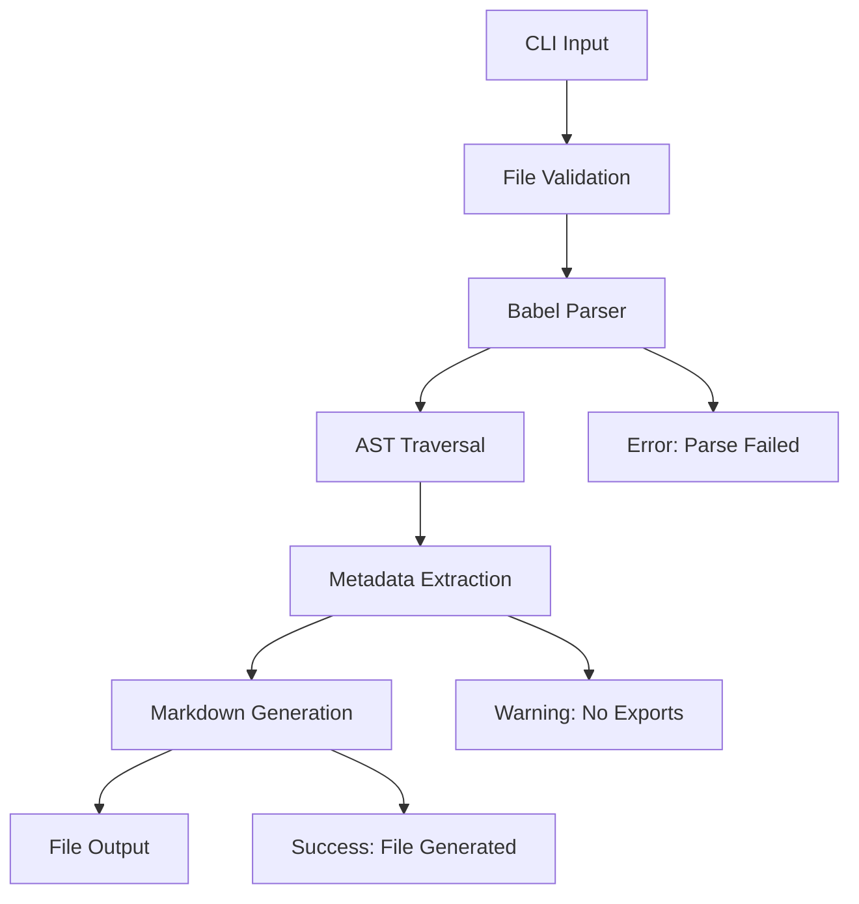
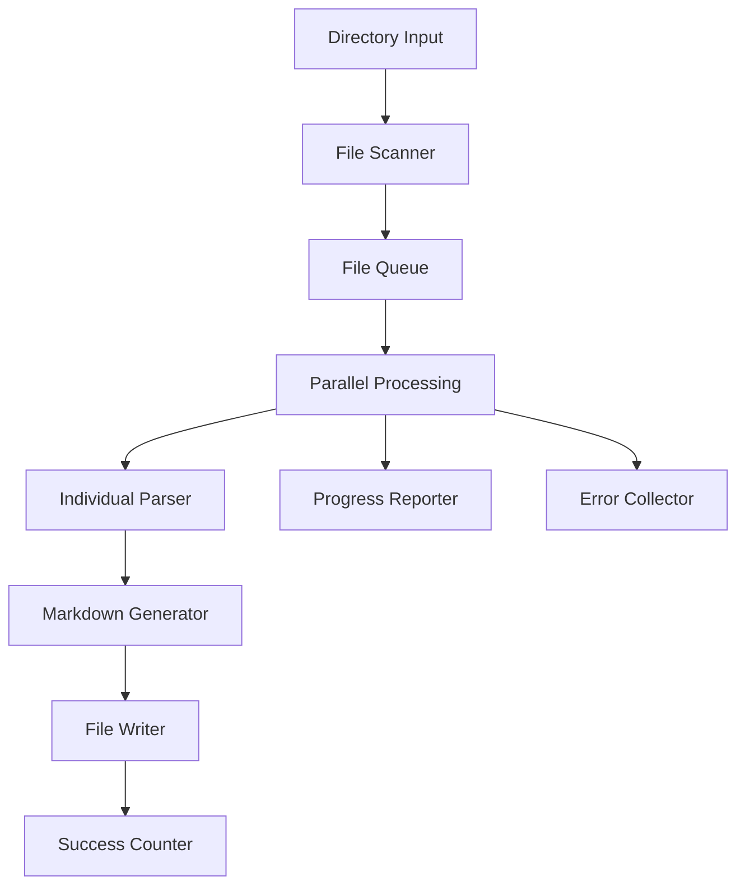
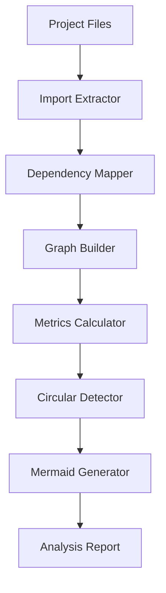

# 🏗️ Architecture Overview

M2JS is designed as a focused, single-purpose CLI tool that transforms TypeScript/JavaScript code into AI-ready Markdown documentation.

## Core Principles

### KISS (Keep It Simple, Stupid)

M2JS follows radical simplicity:

- **Single responsibility**: Code to Markdown transformation
- **No configuration complexity**: Works out-of-the-box
- **Minimal dependencies**: Only essential packages
- **Fast execution**: < 2 seconds for most files

### Vertical Slice Architecture

Every feature is implemented end-to-end:

```
CLI Input → Parser → Generator → File Output
```

No horizontal layers or premature abstractions.

## System Components

### 1. CLI Interface (`cli.ts`)

**Responsibility**: Command-line interface and user interaction

```typescript
// Entry point - handles all user commands
m2js <file>           → processSingleFile()
m2js <dir> --batch    → processDirectory()
m2js <path> --graph   → processGraphAnalysis()
```

**Key Functions**:
- Argument parsing with Commander.js
- File/directory validation
- Progress reporting with Chalk
- Error handling and exit codes

### 2. Parser Engine (`parser.ts`)

**Responsibility**: TypeScript/JavaScript AST parsing

```typescript
// Core parsing pipeline
Source Code → Babel Parser → AST → Extracted Metadata
```

**Extracts**:
- Exported functions with signatures and JSDoc
- Exported classes with methods and properties
- Type definitions and interfaces
- Import/export relationships

**Technology**: Babel parser with TypeScript plugin

### 3. Generator Engine (`generator.ts`)

**Responsibility**: Markdown generation from parsed metadata

```typescript
// Generation pipeline
Parsed Metadata → Hierarchical Structure → Markdown Sections
```

**Generates**:
- Structured Markdown with consistent formatting
- Code blocks with syntax highlighting
- Hierarchical organization (Functions, Classes, Methods)
- Cross-references and links

### 4. Dependency Analyzer (`dependency-analyzer.ts`)

**Responsibility**: Project-level dependency analysis

```typescript
// Dependency analysis pipeline
Multiple Files → Import Analysis → Dependency Graph → Metrics
```

**Features**:
- Internal/external dependency detection
- Circular dependency warnings
- Module connectivity metrics
- Mermaid diagram generation

### 5. Batch Processor (`batch-processor.ts`)

**Responsibility**: Efficient multi-file processing

```typescript
// Batch processing pipeline
Directory Scan → File Filtering → Parallel Processing → Progress Tracking
```

**Capabilities**:
- Recursive directory traversal
- File type filtering (.ts, .tsx, .js, .jsx)
- Error isolation (one file failure doesn't stop batch)
- Progress reporting and statistics

## Data Flow

### Single File Processing



### Batch Processing



### Dependency Analysis



## File Structure

```
src/
├── cli.ts                    # CLI interface and routing
├── parser.ts                 # Core AST parsing logic
├── generator.ts              # Markdown generation engine
├── dependency-analyzer.ts    # Project dependency analysis
├── batch-processor.ts        # Multi-file processing
├── file-scanner.ts          # Directory traversal utilities
├── types.ts                 # TypeScript type definitions
└── utils/                   # Utility functions
```

## Technology Stack

### Core Dependencies

| Package | Purpose | Why Chosen |
|---------|---------|------------|
| `@babel/parser` | AST parsing | Industry standard, TypeScript support |
| `@babel/traverse` | AST traversal | Robust tree walking capabilities |
| `@babel/types` | AST type checking | Type-safe AST manipulation |
| `commander` | CLI framework | Simple, well-established |
| `chalk` | Terminal colors | User-friendly output |

### Language Support

```typescript
// Supported file types
const SUPPORTED_EXTENSIONS = ['.ts', '.tsx', '.js', '.jsx'];

// Babel plugins enabled
const PARSER_PLUGINS = [
  'typescript',        // TypeScript syntax
  'jsx',              // React JSX
  'decorators-legacy', // Decorator support
  'classProperties',   // Class field declarations
  'asyncGenerators',   // Async generator functions
  'bigInt',           // BigInt literal support
  'dynamicImport'     // Dynamic import()
];
```

## Performance Characteristics

### Processing Speed

| File Size | Processing Time | Memory Usage |
|-----------|----------------|--------------|
| < 10KB | < 1s | < 50MB |
| 10-100KB | 1-5s | 50-100MB |
| 100KB-1MB | 5-15s | 100-200MB |

### Token Reduction

| Code Complexity | Original Tokens | M2JS Output | Reduction |
|----------------|----------------|-------------|-----------|
| Simple functions | 500 | 150 | 70% |
| Complex classes | 2000 | 400 | 80% |
| Full modules | 5000 | 750 | 85% |

### Scalability

- **Single file**: Instant feedback (< 1s)
- **Small projects** (< 50 files): < 10s
- **Medium projects** (50-200 files): 30s-2min
- **Large projects** (200+ files): Use selective processing

## Error Handling Strategy

### Fail-Fast Philosophy

M2JS follows a strict fail-fast approach:

```typescript
// Example error handling pattern
function parseFile(filePath: string): ParsedFile {
  // 1. Early validation
  if (!existsSync(filePath)) {
    throw new Error(`File not found: ${filePath}`);
  }
  
  if (!filePath.match(/\.(ts|tsx|js|jsx)$/)) {
    throw new Error(`Unsupported file type: ${filePath}`);
  }
  
  // 2. Clear error context
  try {
    return babel.parse(content);
  } catch (error) {
    throw new Error(`Parse error in ${filePath}: ${error.message}`);
  }
}
```

### Error Categories

1. **User Errors** (exit code 1)
   - File not found
   - Unsupported file type
   - Invalid syntax

2. **System Errors** (exit code 2)
   - Permission denied
   - Out of memory
   - Disk space issues

3. **Parse Errors** (exit code 3)
   - Invalid TypeScript/JavaScript syntax
   - Babel parser failures

## Extension Points

### Currently Disabled Features

These advanced features are temporarily disabled in v1.0.1 due to TypeScript complexity:

```typescript
// Enhanced analysis features (being rebuilt)
interface EnhancedFeatures {
  businessContext: boolean;     // Domain analysis
  usageExamples: boolean;      // Usage pattern extraction
  architectureInsights: boolean; // Architecture analysis
  semanticAnalysis: boolean;   // Entity relationships
}
```

### Future Extensibility

The architecture supports future enhancements:

1. **Plugin System**: Modular analyzers
2. **Custom Templates**: Output format customization
3. **AI Integration**: LLM-powered analysis
4. **IDE Extensions**: Editor integrations

## Quality Assurance

### Testing Strategy

```typescript
// Test coverage requirements
- Unit tests: > 80% coverage for core functions
- Integration tests: End-to-end CLI workflows
- Performance tests: File size and speed benchmarks
- Error handling tests: All failure modes covered
```

### Code Quality Standards

```typescript
// CLAUDE.md compliance
- Files: < 300 lines
- Functions: < 30 lines  
- Cyclomatic complexity: < 10
- No `any` types allowed
- Strict TypeScript mode
```

## Deployment Architecture

### NPM Distribution

```typescript
// Package structure
@paulohenriquevn/m2js/
├── dist/              # Compiled JavaScript
├── package.json       # NPM metadata
├── README.md          # Documentation
├── CHANGELOG.md       # Version history
└── LICENSE           # MIT license
```

### Global Installation

```bash
# User installs globally
npm install -g @paulohenriquevn/m2js

# Creates binary link
/usr/local/bin/m2js -> /usr/local/lib/node_modules/@paulohenriquevn/m2js/dist/cli.js
```

### Cross-Platform Support

- **Windows**: Full compatibility via Node.js
- **macOS**: Native performance
- **Linux**: Primary development platform
- **Docker**: Container support for CI/CD

This architecture ensures M2JS remains simple, fast, and reliable while providing room for future enhancements.