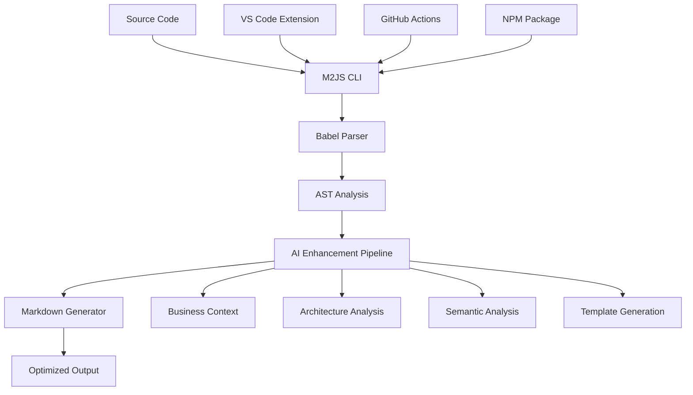

# M2JS Architecture Documentation

🏗️ **Comprehensive guide to M2JS design, architecture, and implementation decisions**

## 📋 Table of Contents

1. [System Overview](#system-overview)
2. [Core Architecture](#core-architecture)
3. [AI Enhancement Pipeline](#ai-enhancement-pipeline)
4. [VS Code Extension Architecture](#vs-code-extension-architecture)
5. [CI/CD Pipeline](#cicd-pipeline)
6. [Performance & Scalability](#performance--scalability)
7. [Security & Privacy](#security--privacy)
8. [Design Decisions](#design-decisions)

## System Overview

### 🎯 Mission Statement
M2JS transforms TypeScript/JavaScript code into LLM-friendly Markdown documentation with 60-90% token reduction, enabling better AI coding assistant interactions through intelligent code analysis.

### 🏗️ High-Level Architecture


### 🎯 Key Value Propositions
1. **Token Efficiency**: 60-90% reduction in LLM context size
2. **Business Intelligence**: Automatic domain and pattern detection
3. **Developer Experience**: Native IDE integration with VS Code
4. **Template-Driven Development**: LLM-guided implementation guides
5. **Zero Configuration**: Works out-of-the-box with smart defaults

## Core Architecture

### 🧩 Component Breakdown

#### 1. CLI Engine (`src/cli.ts`)
**Responsibility**: Command-line interface and orchestration
- Argument parsing with Commander.js
- File discovery and validation
- Output formatting and streaming
- Error handling and user feedback

```typescript
// Core CLI architecture
CLI → File Scanner → Parser → Generator → Output
```

#### 2. Parser Engine (`src/parser.ts`)
**Responsibility**: TypeScript/JavaScript AST analysis
- Babel parser integration
- Type extraction and resolution
- JSDoc comment processing
- Export detection and filtering

```typescript
// Parser pipeline
Source Code → Babel AST → Type Analysis → Export Extraction → Structured Data
```

#### 3. Generator Engine (`src/generator.ts`)
**Responsibility**: Markdown generation and optimization
- Template-based output generation
- Token optimization strategies
- Dependency graph creation
- Mermaid diagram generation

```typescript
// Generator pipeline
Parsed Data → Template Engine → Token Optimization → Markdown Output
```

#### 4. AI Enhancement Pipeline
**Responsibility**: Intelligent analysis and context extraction

##### Business Context Analyzer (`src/business-context-analyzer.ts`)
- Domain detection (e-commerce, blog, API, etc.)
- Framework identification (React, Express, etc.)
- Business rule extraction from JSDoc
- Pattern recognition (Repository, Service Layer, etc.)

##### Architecture Analyzer (`src/architecture-analyzer.ts`)
- Layer architecture detection (MVC, Onion, etc.)
- Design pattern identification
- Dependency analysis
- Code organization insights

##### Semantic Analyzer (`src/semantic-analyzer.ts`)
- Entity relationship extraction
- Business workflow detection
- State transition analysis
- Data flow mapping

##### Usage Pattern Analyzer (`src/usage-pattern-analyzer.ts`)
- Function usage examples
- API pattern detection
- Error handling analysis
- Performance consideration extraction

### 🔄 Data Flow Architecture


## AI Enhancement Pipeline

### 🧠 Intelligence Layers

#### Layer 1: Syntactic Analysis
- **Input**: Raw TypeScript/JavaScript code
- **Process**: Babel AST parsing, type extraction
- **Output**: Structured representation of exports
- **Value**: Clean, noise-free code representation

#### Layer 2: Semantic Analysis
- **Input**: Parsed AST + type information
- **Process**: Entity detection, relationship mapping
- **Output**: Business domain model
- **Value**: Understanding of what the code represents

#### Layer 3: Contextual Analysis
- **Input**: Semantic model + code patterns
- **Process**: Framework detection, pattern recognition
- **Output**: Architectural insights
- **Value**: Understanding of how the code fits in larger system

#### Layer 4: Intent Analysis
- **Input**: All previous layers + JSDoc comments
- **Process**: Business rule extraction, workflow detection
- **Output**: Intent and purpose documentation
- **Value**: Understanding of why the code exists

### 🎯 Domain Detection Strategy

```typescript
// Example domain detection scoring
const domainPatterns = {
  ecommerce: {
    entities: ['User', 'Product', 'Order', 'Cart', 'Payment'],
    methods: ['addToCart', 'checkout', 'processPayment'],
    imports: ['stripe', 'paypal', 'shopping-cart'],
    confidence: calculateConfidence(matches)
  },
  blog: {
    entities: ['Post', 'Author', 'Comment', 'Category'],
    methods: ['publish', 'moderate', 'subscribe'],
    imports: ['markdown', 'cms', 'blog-engine'],
    confidence: calculateConfidence(matches)
  }
};
```

### 📊 Confidence Scoring Algorithm

```typescript
function calculateConfidence(matches: DomainMatch[]): number {
  const weights = {
    entityMatch: 0.4,      // 40% weight for entity names
    methodMatch: 0.3,      // 30% weight for method patterns
    importMatch: 0.2,      // 20% weight for imports
    commentMatch: 0.1      // 10% weight for JSDoc keywords
  };
  
  return Math.min(100, weightedSum(matches, weights));
}
```

## VS Code Extension Architecture

### 🔌 Extension Component Architecture


#### Core Components

##### 1. Extension Entry Point (`src/extension.ts`)
- Extension activation and deactivation
- Command registration
- Event handler setup
- Configuration management

##### 2. M2JS Manager (`src/m2jsManager.ts`)
- CLI integration and bridge
- Auto-detection of M2JS installation
- Command execution and result processing
- Error handling and user feedback

##### 3. Webview Provider (`src/webviewProvider.ts`)
- Interactive result display
- HTML generation with VS Code theming
- User action handling (copy, save, etc.)
- Auto-save to workspace functionality

##### 4. Template Wizard (`src/templateWizard.ts`)
- Interactive template creation
- Domain selection and configuration
- Progressive disclosure UI
- Integration with template generator

##### 5. Project Tree Provider (`src/projectTreeProvider.ts`)
- Project sidebar integration
- Quick action organization
- Category-based navigation
- Command shortcuts

### 🎨 User Experience Flow


## CI/CD Pipeline

### 🔄 Automated Workflow Architecture


#### Pipeline Components

##### 1. Quality Gate (`ci.yml`)
- Multi-Node.js version testing (16, 18, 20)
- TypeScript compilation validation
- ESLint and Prettier checks
- Unit and integration tests
- Code coverage reporting

##### 2. Security Pipeline
- npm audit for vulnerabilities
- CodeQL static analysis
- Dependency scanning
- License compliance checking

##### 3. Performance Pipeline
- Benchmark execution on various file sizes
- Memory usage profiling
- CLI startup time measurement
- Regression detection

##### 4. Release Pipeline (`release.yml`)
- Automated version management
- Changelog generation
- Dual publishing (NPM + VS Code)
- Asset creation and upload

### 📊 Quality Metrics

```yaml
Quality Gates:
  - Test Coverage: >80%
  - TypeScript Strict: 100% compliance
  - ESLint: Zero errors
  - Security: Zero high/critical vulnerabilities
  - Performance: <2s processing for <1MB files
  - Build: 100% success rate across all Node versions
```

## Performance & Scalability

### ⚡ Performance Optimization Strategies

#### 1. Parser Optimization
- **Lazy Loading**: Only parse exported symbols
- **Caching**: AST caching for repeated analysis
- **Streaming**: Process large files in chunks
- **Parallel Processing**: Multi-file batch processing

#### 2. Memory Management
- **Garbage Collection**: Explicit cleanup of large ASTs
- **Memory Pooling**: Reuse parser instances
- **Streaming Output**: Don't hold entire output in memory

#### 3. Token Optimization Levels

```typescript
const optimizationLevels = {
  minimal: {
    includeComments: false,
    includeTypes: false,
    includeExamples: false,
    reduction: "90%"
  },
  balanced: {
    includeComments: true,
    includeTypes: true, 
    includeExamples: false,
    reduction: "70%"
  },
  detailed: {
    includeComments: true,
    includeTypes: true,
    includeExamples: true,
    reduction: "50%"
  }
};
```

### 📈 Scalability Considerations

#### File Size Handling
- **Small Files** (<10KB): Full analysis
- **Medium Files** (10KB-1MB): Selective analysis
- **Large Files** (>1MB): Streaming analysis with progress

#### Project Scale
- **Small Projects** (<100 files): Full dependency analysis
- **Medium Projects** (100-1000 files): Selective analysis
- **Large Projects** (>1000 files): On-demand analysis

## Security & Privacy

### 🛡️ Security Architecture

#### 1. Local Processing Model
- **Zero Cloud Processing**: All analysis runs locally
- **No Data Collection**: Zero telemetry or usage tracking
- **Offline Capability**: Works without internet connection

#### 2. Input Validation
- **File Type Validation**: Only process supported extensions
- **Path Validation**: Prevent directory traversal
- **Size Limits**: Prevent resource exhaustion
- **Content Sanitization**: Escape special characters in output

#### 3. Output Security
- **XSS Prevention**: Sanitize all HTML output
- **Path Traversal Protection**: Validate output paths
- **Permission Checking**: Respect file system permissions

### 🔒 Privacy Guarantees

```yaml
Data Handling:
  - Source Code: Never leaves local machine
  - Analysis Results: Stored locally only
  - Configuration: Local VS Code settings
  - Telemetry: Completely disabled
  - Network Requests: None (except extension updates)
```

## Design Decisions

### 🎯 Architectural Decisions

#### 1. CLI-First Architecture
**Decision**: Build CLI first, then VS Code extension
**Rationale**: 
- Universal tool that works in any environment
- Easier testing and debugging
- Can be integrated into any workflow
- VS Code extension becomes a UI layer

#### 2. Babel Parser Choice
**Decision**: Use Babel parser instead of TypeScript compiler
**Rationale**:
- Better handling of mixed JS/TS codebases
- More flexible plugin system
- Consistent AST format
- Better error recovery

#### 3. Local-Only Processing
**Decision**: No cloud processing or API calls
**Rationale**:
- Developer privacy and security
- Works offline
- No rate limits or costs
- Corporate firewall friendly

#### 4. Token Optimization Focus
**Decision**: Prioritize token reduction over complete representation
**Rationale**:
- LLM context windows are expensive
- 80/20 rule: 20% of code provides 80% of value
- Focus on exported APIs, not implementation
- Business context > implementation details

### 🔄 Evolution Strategy

#### Phase 1 (Current): Core Functionality ✅
- TypeScript/JavaScript support
- Basic AI enhancement
- VS Code integration
- CI/CD pipeline

#### Phase 2 (Next): Enhanced Intelligence
- Better domain detection
- More framework support
- Custom template creation
- Performance optimization

#### Phase 3 (Future): Ecosystem Expansion
- Multi-language support (Python, Java, C#)
- Team collaboration features
- IDE integrations (JetBrains, Vim)
- Advanced analytics

### 📊 Success Metrics

```yaml
Technical Metrics:
  - Token Reduction: Target 60-90%
  - Processing Speed: <2s for typical files
  - Accuracy: >95% for domain detection
  - Reliability: <1% failure rate

User Metrics:
  - VS Code Extension Downloads: Target 10K+
  - NPM Package Downloads: Target 1K+/month
  - GitHub Stars: Target 1K+
  - Community Contributions: Target 10+ contributors

Business Metrics:
  - Developer Productivity: Measure context preparation time
  - AI Assistant Effectiveness: Measure better AI responses
  - Adoption Rate: Track daily/weekly active users
```

---

## 🚀 Getting Started for Contributors

### Development Setup
```bash
# Clone repository
git clone https://github.com/paulohenriquevn/m2js.git
cd m2js

# Install dependencies
npm install

# Build and test
npm run build
npm test

# Test CLI locally
npm link
m2js examples/User.ts

# VS Code extension development
cd vscode-extension
npm install
npm run compile
# Press F5 to launch Extension Development Host
```

### Architecture Principles to Follow
1. **KISS**: Keep implementations simple and focused
2. **FAIL-FAST**: Fail quickly with clear error messages
3. **VERTICAL SLICE**: Each feature should work end-to-end
4. **ANTI-MOCK**: Use real integrations in development
5. **LOCAL-FIRST**: Never send code to external services

This architecture enables M2JS to be a powerful, reliable, and secure tool for enhancing developer productivity with AI coding assistants while maintaining complete privacy and control over source code.