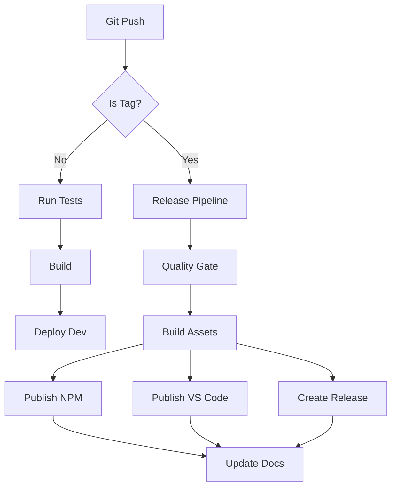

# M2JS Deployment Guide

🚀 **Complete guide for deploying M2JS CLI and VS Code Extension to production**

## 📋 Table of Contents

1. [Overview](#overview)
2. [NPM Package Deployment](#npm-package-deployment)
3. [VS Code Extension Deployment](#vs-code-extension-deployment)
4. [GitHub Releases](#github-releases)
5. [Automated CI/CD](#automated-cicd)
6. [Manual Deployment](#manual-deployment)
7. [Post-Deployment](#post-deployment)
8. [Troubleshooting](#troubleshooting)

## Overview

M2JS has two main distribution channels:
1. **NPM Package**: `@paulohenriquevn/m2js` (CLI tool)
2. **VS Code Extension**: `m2js-vscode` (IDE integration)

Both are automatically deployed via GitHub Actions when tags are created.

## NPM Package Deployment

### 🔧 Prerequisites

```bash
# Ensure you have npm access
npm whoami
# Should return your npm username

# Check if you're a collaborator on the package
npm owner ls @paulohenriquevn/m2js
```

### 🚀 Automated Deployment (Recommended)

The easiest way to deploy is using our automated pipeline:

```bash
# 1. Ensure all changes are committed and pushed
git add .
git commit -m "feat: prepare for release v1.1.0"
git push origin main

# 2. Create and push a version tag
npm version patch  # for bug fixes
npm version minor  # for new features  
npm version major  # for breaking changes

# 3. Push the tag to trigger deployment
git push --tags

# GitHub Actions will automatically:
# - Run all tests and quality checks
# - Build the package
# - Publish to NPM
# - Create GitHub release
# - Update documentation
```

### 📊 Deployment Pipeline Status

Monitor the deployment at:
- **GitHub Actions**: https://github.com/paulohenriquevn/m2js/actions
- **NPM Package**: https://www.npmjs.com/package/@paulohenriquevn/m2js
- **GitHub Releases**: https://github.com/paulohenriquevn/m2js/releases

### 🔍 Version Strategy

```bash
# Semantic Versioning (semver)
MAJOR.MINOR.PATCH

# Examples:
1.0.0 → 1.0.1  # Bug fix (patch)
1.0.1 → 1.1.0  # New feature (minor)
1.1.0 → 2.0.0  # Breaking change (major)

# Pre-release versions
1.1.0-alpha.1  # Alpha release
1.1.0-beta.1   # Beta release
1.1.0-rc.1     # Release candidate
```

### 📋 Pre-Release Checklist

Before creating a release tag:

```bash
# ✅ Quality Gates
npm run validate    # All tests, linting, type-checking
npm run build      # Successful build
npm run test:coverage  # Adequate test coverage

# ✅ Manual Testing
npm link
m2js examples/User.ts              # Basic functionality
m2js examples/User.ts --ai-enhanced # Advanced features
m2js examples/ --batch             # Batch processing

# ✅ Documentation
# Update CHANGELOG.md with new features/fixes
# Update README.md if needed
# Update version in package.json (npm version does this)

# ✅ Backward Compatibility
# Ensure CLI flags still work
# Ensure VS Code extension compatibility
# Test with existing user workflows
```

## VS Code Extension Deployment

### 🔧 Prerequisites

```bash
# Install VSCE (VS Code Extension Manager)
npm install -g @vscode/vsce

# Get a Personal Access Token from:
# https://dev.azure.com/YOUR-ORG/_usersSettings/tokens
# Scopes needed: Marketplace (Manage)
```

### 📦 Extension Packaging

```bash
cd vscode-extension

# 1. Update version in package.json
npm version patch

# 2. Compile extension
npm run compile

# 3. Package extension
vsce package

# Output: m2js-vscode-X.Y.Z.vsix
```

### 🚀 Extension Publishing

#### Automated (via GitHub Actions)
```bash
# Extensions are automatically published when tags are created
git tag v1.1.0
git push --tags

# GitHub Actions will:
# - Build both CLI and extension
# - Package extension
# - Publish to VS Code Marketplace
# - Update extension listing
```

#### Manual Publishing
```bash
cd vscode-extension

# Login to marketplace (one-time setup)
vsce login YOUR-PUBLISHER-NAME

# Publish extension
vsce publish

# Or publish specific version
vsce publish 1.1.0

# Or publish pre-release
vsce publish --pre-release
```

### 📋 Extension Review Process

VS Code Marketplace has an automated review process:

1. **Upload**: Extension is uploaded and scanned
2. **Validation**: Automated security and quality checks
3. **Review**: Manual review for policy compliance (if flagged)
4. **Publication**: Extension becomes available (usually within 1 hour)

## GitHub Releases

### 🔄 Automated Release Creation

Our GitHub Actions workflow automatically creates releases:

```yaml
# .github/workflows/release.yml triggers on tags
name: Release & Publish
on:
  push:
    tags: ['v*.*.*']

# Creates:
# - GitHub Release with changelog
# - NPM package publication
# - VS Code extension publication
# - Release assets (CLI binaries, extension .vsix)
```

### 📝 Release Notes Template

```markdown
# M2JS v1.1.0

## 🎉 What's New

### ✨ New Features
- **AI Enhancement**: Improved business domain detection
- **VS Code**: New template wizard with better UX
- **Performance**: 30% faster processing for large files

### 🐛 Bug Fixes
- Fixed type resolution for complex generic types
- Improved error messages for malformed JSDoc
- Fixed VS Code extension auto-save path issues

### 🔧 Improvements
- Better token optimization for minimal mode
- Enhanced Mermaid diagram generation
- Improved CLI help text and examples

## 📦 Installation

### NPM Package
```bash
npm install -g @paulohenriquevn/m2js@1.1.0
```

### VS Code Extension
Install from VS Code Marketplace: [M2JS - Markdown from JavaScript](https://marketplace.visualstudio.com/items?itemName=m2js.m2js-vscode)

## 🔗 Assets
- [CLI Binary (Universal)](link-to-binary)
- [VS Code Extension (.vsix)](link-to-vsix)
- [Source Code](link-to-source)

## 🙏 Contributors
Thanks to all contributors who made this release possible!
```

## Automated CI/CD

### 🔄 Workflow Overview



### 📋 Pipeline Configuration

#### 1. Quality Gate (`ci.yml`)
```yaml
name: CI Pipeline
on: [push, pull_request]

jobs:
  test:
    strategy:
      matrix:
        node-version: [16.x, 18.x, 20.x]
        os: [ubuntu-latest, windows-latest, macos-latest]
    
    steps:
      - uses: actions/checkout@v4
      - uses: actions/setup-node@v4
      - run: npm ci
      - run: npm run validate
      - run: npm run build
      - run: npm run test:integration
```

#### 2. Release Pipeline (`release.yml`)
```yaml
name: Release Pipeline
on:
  push:
    tags: ['v*.*.*']

jobs:
  release:
    runs-on: ubuntu-latest
    steps:
      - name: Create Release
        uses: actions/create-release@v1
        env:
          GITHUB_TOKEN: ${{ secrets.GITHUB_TOKEN }}
      
      - name: Publish NPM
        run: npm publish
        env:
          NODE_AUTH_TOKEN: ${{ secrets.NPM_TOKEN }}
      
      - name: Publish VS Code Extension
        run: vsce publish -p ${{ secrets.VSCODE_TOKEN }}
```

### 🔑 Required Secrets

Configure these secrets in GitHub repository settings:

```bash
# NPM Publishing
NPM_TOKEN=npm_xxxxxxxxxxxx

# VS Code Marketplace Publishing  
VSCODE_TOKEN=xxxxxxxxxxxxxxxx

# GitHub Releases (automatic)
GITHUB_TOKEN=ghp_xxxxxxxxxxxx
```

### 📊 Monitoring & Alerts

```yaml
# Monitor deployment success
Deployment Metrics:
  - NPM Download Count: Track adoption
  - VS Code Extension Installs: Monitor growth
  - GitHub Release Downloads: Monitor engagement
  - Error Rates: Track deployment failures

# Set up alerts for:
Alert Conditions:
  - Deployment Failure: Immediate notification
  - Download Drop: Weekly monitoring
  - High Error Rate: Real-time monitoring
  - Security Vulnerabilities: Immediate notification
```

## Manual Deployment

### 🛠️ Emergency Manual Deployment

If automated deployment fails, use manual process:

#### NPM Package
```bash
# 1. Prepare environment
export NODE_AUTH_TOKEN="your-npm-token"
npm whoami  # Verify authentication

# 2. Build and test
npm run validate
npm run build

# 3. Publish
npm publish --access public

# 4. Verify
npm view @paulohenriquevn/m2js versions --json
```

#### VS Code Extension
```bash
cd vscode-extension

# 1. Prepare
npm run compile
vsce package

# 2. Test locally
vsce install m2js-vscode-X.Y.Z.vsix

# 3. Publish
vsce publish -p YOUR-ACCESS-TOKEN

# 4. Verify
# Check https://marketplace.visualstudio.com/manage/publishers/m2js
```

### 🔍 Manual Verification

```bash
# Test NPM package
npm install -g @paulohenriquevn/m2js@latest
m2js --version
m2js examples/User.ts

# Test VS Code extension
# Install from marketplace
# Test all commands in VS Code
# Verify webviews and functionality
```

## Post-Deployment

### 📋 Post-Release Checklist

```bash
# ✅ Verification
- [ ] NPM package available and installable
- [ ] VS Code extension available in marketplace
- [ ] GitHub release created with assets
- [ ] Documentation updated
- [ ] CHANGELOG.md updated

# ✅ Communication
- [ ] Announce on GitHub Discussions
- [ ] Update project README badges
- [ ] Social media announcement (if major release)
- [ ] Community notification

# ✅ Monitoring
- [ ] Monitor error rates
- [ ] Check download/install metrics
- [ ] Watch for user feedback/issues
- [ ] Monitor CI/CD pipeline health
```

### 📊 Success Metrics

Track these metrics post-deployment:

```yaml
Adoption Metrics:
  - NPM Downloads/Week: Target growth of 10%
  - VS Code Extension Installs: Target 100+ new installs/week
  - GitHub Stars: Monitor community interest
  - GitHub Issues: Track user feedback

Quality Metrics:
  - Error Rate: Should be <1%
  - User Satisfaction: Monitor issue reports
  - Performance: No regression in processing speed
  - Compatibility: No breaking changes reported
```

### 🔄 Hotfix Process

For critical bugs discovered post-release:

```bash
# 1. Create hotfix branch
git checkout -b hotfix/v1.1.1
git checkout main

# 2. Fix the issue
# Make minimal changes to fix critical bug

# 3. Test thoroughly
npm run validate
npm run test:integration

# 4. Quick release
npm version patch
git push --tags

# 5. Monitor deployment
# Ensure hotfix deploys successfully
```

## Troubleshooting

### 🚨 Common Deployment Issues

#### NPM Publish Failures
```bash
# Issue: 403 Forbidden
# Solution: Check NPM authentication
npm whoami
npm login

# Issue: Version already exists
# Solution: Increment version
npm version patch

# Issue: Package too large
# Solution: Check .npmignore
npm pack --dry-run
```

#### VS Code Extension Issues
```bash
# Issue: Extension validation failed
# Solution: Check package.json manifest
vsce package --no-dependencies

# Issue: Marketplace login failed
# Solution: Regenerate access token
vsce login YOUR-PUBLISHER

# Issue: Extension not appearing
# Solution: Check marketplace status
# Visit: https://marketplace.visualstudio.com/manage
```

#### GitHub Actions Failures
```bash
# Issue: Tests failing on CI
# Solution: Run locally first
npm run validate
npm test

# Issue: Secrets not configured
# Solution: Check repository settings
# GitHub Settings > Secrets and variables > Actions

# Issue: Workflow not triggering
# Solution: Check tag format
git tag v1.1.0  # Must start with 'v'
```

### 🛟 Emergency Procedures

#### Rollback Deployment
```bash
# NPM: Cannot delete published versions
# Instead: Publish new version with fix
npm version patch
npm publish

# VS Code: Can unpublish within 72 hours
vsce unpublish

# GitHub: Delete release and tag
git tag -d v1.1.0
git push origin :refs/tags/v1.1.0
```

#### Critical Security Issue
```bash
# 1. Immediately unpublish if possible
vsce unpublish  # VS Code extension
# NPM: Contact npm support for critical security

# 2. Create security patch
git checkout -b security-patch
# Fix security issue
# Test thoroughly

# 3. Emergency release
npm version patch
git push --tags

# 4. Notify users
# Create GitHub security advisory
# Announce in community channels
```

### 📞 Support Contacts

```yaml
Support Channels:
  - GitHub Issues: https://github.com/paulohenriquevn/m2js/issues
  - NPM Support: https://www.npmjs.com/support
  - VS Code Marketplace: https://marketplace.visualstudio.com/manage
  - Maintainer Contact: [Contact information]

Response Times:
  - Critical Security: Within 2 hours
  - Deployment Issues: Within 24 hours
  - General Issues: Within 48 hours
```

---

## 🎯 Quick Reference

### Release Commands
```bash
# Standard release
npm version minor && git push --tags

# Pre-release  
npm version prerelease --preid=beta && git push --tags

# Hotfix
npm version patch && git push --tags
```

### Verification Links
- **NPM**: https://www.npmjs.com/package/@paulohenriquevn/m2js
- **VS Code**: https://marketplace.visualstudio.com/items?itemName=m2js.m2js-vscode
- **GitHub**: https://github.com/paulohenriquevn/m2js/releases
- **CI/CD**: https://github.com/paulohenriquevn/m2js/actions

This deployment guide ensures reliable, automated releases while providing fallback procedures for manual deployment when needed.