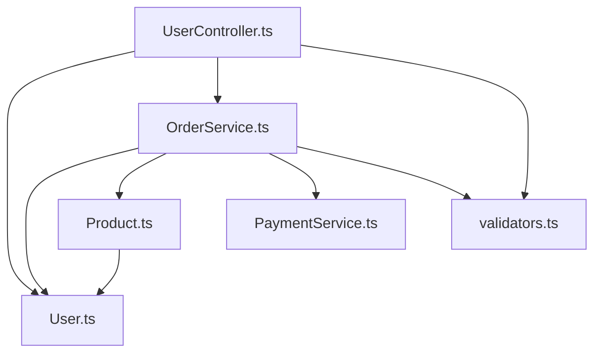

# 📊 Dependency Analysis - ./examples/ecommerce-api/src

## 🔗 Module Dependencies
### Internal Dependencies
- **UserController.ts** → `../models/User` (3x), `../services/OrderService`, `../utils/validators` (3x)
- **Product.ts** → `./User`
- **OrderService.ts** → `../models/User`, `../models/Product`, `./PaymentService`, `../utils/validators`

## 📈 Dependency Metrics
- **Total Modules**: 6
- **Total Dependencies**: 12
- **Internal Dependencies**: 12
- **External Dependencies**: 0
- **Average Dependencies per Module**: 2
- **Most Connected Module**: UserController.ts
- **Circular Dependencies**: ❌ None detected

## 🏗️ Architecture Layers
### Core Logic
- **UserController.ts** - Core functionality
- **Product.ts** - Core functionality
- **User.ts** - Core functionality
- **OrderService.ts** - Core functionality
- **PaymentService.ts** - Core functionality
- **validators.ts** - Core functionality

## 🗺️ Visual Dependency Map
